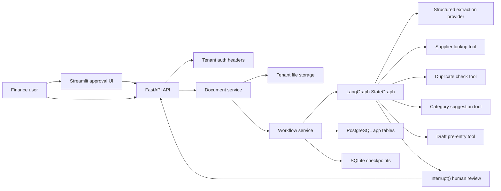

# Enterprise Finance Agent Architecture

## Notes

- Autonomy stops at draft creation. No irreversible posting happens automatically.
- `interrupt()` plus SQLite checkpointing gives pause and resume across sessions.
- Every tool call is audited with args, result, duration, and error.
